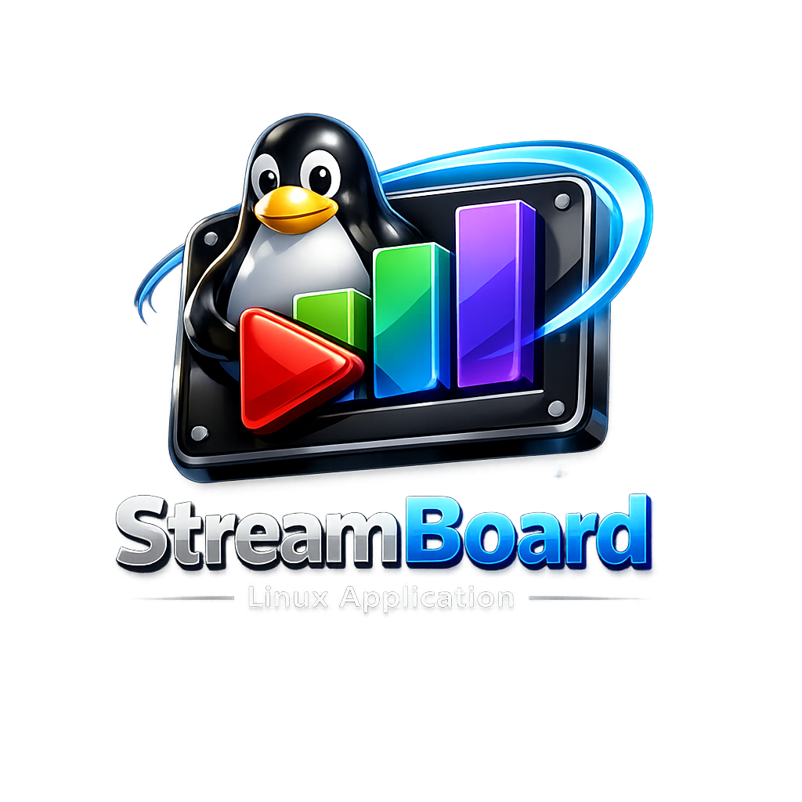

<div align="center">



# StreamBoard

**Soundboard ringan untuk Linux Streamer**

Putar sound effect dengan shortcut keyboard global — bahkan saat OBS atau game sedang aktif.

[](https://github.com)
[](https://python.org)
[](https://gtk.org)
[](LICENSE)


</div>

---

## ✨ Fitur

- 🎵 **Auto-detect sound files** — taruh file di folder, langsung muncul di app
- 🔄 **Auto-refresh** — folder di-watch realtime, tidak perlu restart
- ⌨️ **Global keyboard shortcut** — aktif meskipun aplikasi tidak fokus
- 🎚️ **Volume control** — slider volume dengan simpan otomatis
- ⏹️ **Stop All** — hentikan semua sound sekaligus
- 🖥️ **Minimize ke system tray** — close window tidak benar-benar exit
- 📦 **Format didukung** — MP3, WAV, OGG, FLAC, M4A
- 🚀 **Background service** — jalan otomatis saat login, tanpa buka terminal
- 🔍 **GNOME app launcher** — bisa dicari di Activities (tekan `Super`)

---

## 📋 Requirements

| Requirement | Versi |
|---|---|
| Linux | Ubuntu 22.04+ / Debian / Fedora / Arch |
| Python | 3.8+ |
| Desktop | GNOME (X11) |
| ffmpeg | Untuk playback audio |

> ⚠️ **Global shortcut membutuhkan X11**, bukan Wayland.
> Cek dengan: `echo $XDG_SESSION_TYPE`
> Kalau output `wayland`: logout → klik ⚙️ di login screen → pilih **GNOME on Xorg**

---

## 🚀 Instalasi

### 1. Clone repo

```bash
git clone https://github.com/USERNAME/streamboard.git
cd streamboard
```

### 2. Install dependencies

```bash
chmod +x install.sh
./install.sh
```

Script ini otomatis mendeteksi distro (Ubuntu/Debian/Fedora/Arch) dan menginstall semua yang dibutuhkan:
- System packages: `python3-gi`, `gtk3`, `ffmpeg`, dll
- Python packages: `watchdog`, `pynput`

### 3. Jalankan

```bash
cd ~/StreamBoard
python3 soundboard.py
```

---

## 🖥️ Install sebagai Background Service

Agar StreamBoard jalan otomatis di background saat login (tanpa buka terminal):

```bash
chmod +x streamboard-service.sh
bash streamboard-service.sh install
```

Ini akan:
- ✅ Mendaftarkan StreamBoard sebagai **systemd user service**
- ✅ Auto-start saat login
- ✅ Menambahkan ke **GNOME app launcher** (tekan `Super`, cari "StreamBoard")
- ✅ Membuat **shortcut di Desktop**
- ✅ Menggunakan `logo.png` sebagai icon aplikasi

### Perintah service

```bash
bash streamboard-service.sh start    # jalankan
bash streamboard-service.sh stop     # hentikan
bash streamboard-service.sh restart  # restart
bash streamboard-service.sh status   # cek status
bash streamboard-service.sh log      # lihat log error
bash streamboard-service.sh remove   # hapus service & shortcut
```

---

## 🎮 Cara Pakai

### Tambah Sound

Taruh file MP3/WAV/OGG ke folder:
```
~/StreamBoard/sounds/
```
StreamBoard otomatis mendeteksi file baru — tidak perlu restart.

Atau klik tombol **📁 SOUNDS FOLDER** di aplikasi.

### Assign Shortcut Keyboard

1. Klik tombol **ASSIGN KEY** di samping nama sound
2. Status bar berubah: `⏺ PRESS ANY KEY COMBO...`
3. Tekan kombinasi keyboard (contoh: `F5`, `Ctrl+1`, `Alt+Shift+B`)
4. Shortcut tersimpan otomatis

### Tips Shortcut untuk Streamer

| Sound | Shortcut yang direkomendasikan |
|---|---|
| Sound effect pendek | `F5` – `F8` |
| Alert / notifikasi | `Ctrl+F1` |
| Musik intro | `Alt+1` |
| Outro / ending | `Alt+2` |
| Reaction sound | `Ctrl+Shift+1` – `3` |

> Hindari shortcut yang bentrok dengan OBS (`Ctrl+Alt+Del`, dll)

### Hapus Shortcut

Klik tombol **✕** di sebelah kanan shortcut badge.

---

## 📁 Struktur Project

```
streamboard/
├── soundboard.py           # Aplikasi utama (GTK3 + Python)
├── install.sh              # Auto-installer dependencies
├── streamboard-service.sh  # Manager background service & app launcher
├── build_appimage.sh       # Build AppImage portabel (opsional)
├── logo.png                # Icon aplikasi
└── sounds/                 # Folder sample sounds (opsional)
```

**Konfigurasi disimpan di:**
```
~/.config/streamboard/config.json
```

Contoh isi:
```json
{
  "shortcuts": {
    "/home/user/StreamBoard/sounds/intro.mp3": "ctrl+1",
    "/home/user/StreamBoard/sounds/drum.wav": "f5"
  },
  "volume": 80
}
```

---

## 🔧 Troubleshooting

<details>
<summary><b>Global shortcut tidak berfungsi</b></summary>

```bash
# Pastikan X11
echo $XDG_SESSION_TYPE   # harus: x11

# Cek pynput
python3 -c "from pynput import keyboard; print('OK')"
```

Kalau Wayland: logout → di login screen klik ⚙️ → pilih **GNOME on Xorg**
</details>

<details>
<summary><b>Tidak ada suara / MP3 tidak bunyi</b></summary>

```bash
# Cek ffplay tersedia
which ffplay

# Install kalau belum ada
sudo apt install ffmpeg

# Test manual
ffplay -nodisp -autoexit /path/to/file.mp3
```
</details>

<details>
<summary><b>Tray icon tidak muncul di GNOME</b></summary>

Install GNOME extension **AppIndicator and KStatusNotifierItem Support**:

```bash
sudo apt install gir1.2-appindicator3-0.1
```

Lalu install ekstensinya di: https://extensions.gnome.org/extension/615/appindicator-support/
</details>

<details>
<summary><b>Error: No module named 'gi'</b></summary>

```bash
sudo apt install python3-gi python3-gi-cairo gir1.2-gtk-3.0
```
</details>

<details>
<summary><b>pip error: externally-managed-environment (Ubuntu 24.04+)</b></summary>

Script `install.sh` sudah menangani ini otomatis dengan flag `--break-system-packages`.
Kalau masih error, jalankan manual:

```bash
pip3 install --user --break-system-packages watchdog pynput
```
</details>

<details>
<summary><b>Cek log service</b></summary>

```bash
bash streamboard-service.sh log
# atau
journalctl --user -u streamboard.service -n 50
```
</details>

---

## 📦 Build AppImage (Opsional)

Untuk membuat `.AppImage` yang bisa dijalankan di distro lain tanpa install:

```bash
pip3 install appimage-builder --break-system-packages
chmod +x build_appimage.sh
./build_appimage.sh
```

Output: `build/StreamBoard-1.0.0-x86_64.AppImage`

```bash
chmod +x StreamBoard-1.0.0-x86_64.AppImage
./StreamBoard-1.0.0-x86_64.AppImage
```

---

## 🤝 Kontribusi

Pull request dan issues sangat disambut! Beberapa ide pengembangan:

- [ ] Wayland support (via GNOME Shell extension)
- [ ] Audio routing ke virtual cable (OBS integration)
- [ ] Multiple sound folder
- [ ] Sound categories / grouping
- [ ] Waveform preview per sound
- [ ] Import/export shortcut config

---

## 📄 Lisensi

MIT License — bebas digunakan, dimodifikasi, dan didistribusikan.

---

<div align="center">

Dibuat untuk komunitas streamer Linux 🎮

**[⭐ Star repo ini](../../stargazers) kalau StreamBoard membantu streaming kamu!**

</div>
